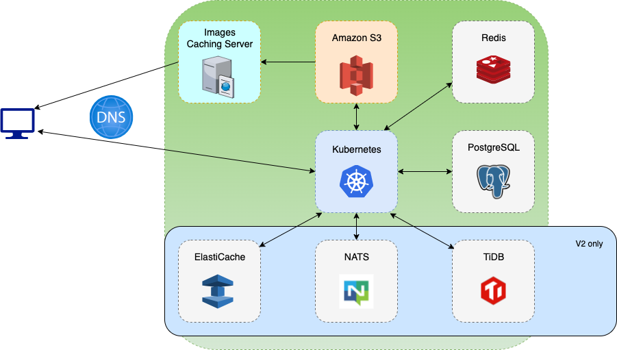
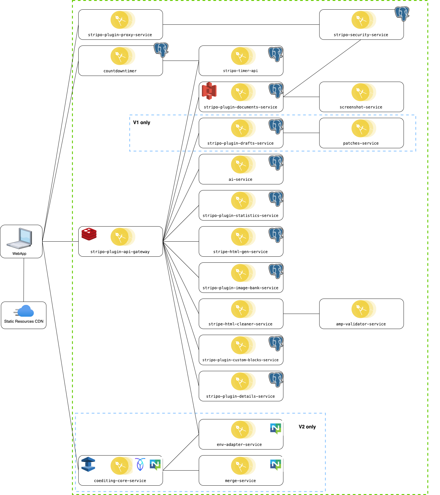

<br/>

# Stripo plugin deployment manual

## Table of Contents

1. [Overview](#overview)
2. [System Architecture](#system-architecture)
   - [Kubernetes Cluster with Microservices](#kubernetes-cluster-with-microservices)
   - [PostgreSQL](#postgresql)
   - [Redis](#redis)
   - [Amazon S3](#amazon-s3)
   - [Additional Components for Stripo Editor V2](#additional-components-for-stripo-editor-v2)
3. [Microservices Architecture Overview](#microservices-architecture-overview)
   - [Microservice Dependencies](#microservice-dependencies)
   - [Logging and Monitoring](#logging-and-monitoring)
   - [Microservice Responsibilities](#microservice-responsibilities)
4. [Prerequisites](#prerequisites)
5. [Deployment Process](#deployment-process)
   - [Step 1: Create PostgreSQL Databases](#step-1-create-postgresql-databases)
   - [Step 2: Insert Required Data into the PostgreSQL Database](#step-2-insert-required-data-into-the-postgresql-database)
     - [Plugin Configuration Parameters](#plugin-configuration-parameters)
   - [Step 3: Additional Steps to Configure Stripo Editor V2 (V2 only)](#additional-steps-to-configure-stripo-editor-v2)
      - [Step 1: Create TiDB Database](#step-1-create-tidb-database)
      - [Step 2: Create NATS Account](#step-2-create-nats-account)
      - [Step 3: Create AWS ElastiCache Cluster](#step-3-create-an-aws-elasticache-cluster)
   - [Step 4: Configure Amazon S3 Bucket](#step-3-configure-amazon-s3-bucket)
   - [Step 5: Update Helm Chart Configurations](#step-4-update-helm-chart-configurations)
   - [Step 6: Configure Stripo Docker Hub Access](#step-5-configure-stripo-docker-hub-access)
   - [Step 7: Configure Logging](#step-6-configure-logging)
   - [Step 8: Deploy Microservices](#step-7-deploy-microservices)
   - [Step 9: Configure Countdown Timer](#step-8-configure-countdown-timer)
   - [Step 10: Configure CDN for Static Resources](#step-10-configure-cdn-for-static-resources)
6. [Testing](#testing)
   - [Stripo Editor V1](#stripo-editor-v1)
   - [Stripo Editor V2](#stripo-editor-v2)
7. [Migration Guide](#migration-guide)

---

## Overview
This repository contains the web application built using microservices architecture. The services are deployed on a Kubernetes cluster using Helm charts. Below, you will find detailed instructions on how to set up the environment, configure the necessary components, and deploy the services.

## System Architecture

The Stripo ecosystem consists of several key components, each playing a crucial role in ensuring seamless operations and communication between services. Below is a breakdown of the main parts of the architecture:

- **Kubernetes Cluster with Microservices**:  
  All services are containerized and deployed as Docker images within a Kubernetes cluster, enabling a scalable and distributed microservices architecture.

- **PostgreSQL**:  
  Serves as the primary relational database for microservices that require structured data storage.

- **Redis**:  
  Used for managing rate-limiting information, ensuring efficient access control across microservices.

- **Amazon S3**:  
  Provides a scalable storage solution for media assets, such as images and files, with high availability and durability.

### Additional Components for Stripo Editor V2:

- **NATS**:  
  Facilitates messaging and communication between microservices, allowing them to interact in a decoupled manner.

- **TiDB**:  
  A distributed database that stores email templates and patch information, providing scalability and consistency for critical data.

- **Amazon ElastiCache**:  
  Used to store co-editing session information, enabling real-time collaboration by efficiently caching session data.



## Microservices Architecture Overview

The Plugin infrastructure is composed of 20 microservices, each containerized using Docker. These Docker images are hosted in Stripo's Docker Hub repository. Enterprise plan partners are granted read-only access to this repository, allowing them to download the required images with specific versions when they choose to host the Plugin Backend on their own servers.

### Microservice Dependencies

Several microservices rely on external services such as **PostgreSQL**, **CockroachDB**, and **Redis**. These dependencies can be deployed on any infrastructure. The connection between each microservice and its dependencies is defined within the properties in these Helm charts, ensuring smooth and customizable deployments.

### Logging and Monitoring

Each microservice has the option to send its logs to an **ELK stack** (Elasticsearch, Logstash, and Kibana) for monitoring and analysis. Like the dependencies, the ELK stack can be deployed anywhere, and its URL can be specified via properties. This ensures flexible monitoring setups for partners hosting the Plugin Backend on their servers.

### Microservice Responsibilities

The table below outlines the current microservices, their roles, and their requirements for different plugin versions (V1 and V2). It also specifies which services are public-facing for web access.

| Service Name                            | Responsibility                                                                                         | Public (Web) | Required for V1 | Required for V2 |
|-----------------------------------------|--------------------------------------------------------------------------------------------------------|--------------|-----------------|-----------------|
| **stripo-plugin-api-gateway**           | Handles user authentication, authorization, and request routing.                                       | true         | true            | true            |
| **stripo-plugin-proxy-service**         | Proxies Stripo editor JS requests to avoid CORS errors when accessing different domains.               | true         | true            | true            |
| **countdowntimer**                      | Generates timer GIFs for countdown elements.                                                           | true         | true            | true            |
| **stripo-plugin-details-service**       | Manages CRUD operations for plugin configuration.                                                      | false        | true            | true            |
| **stripo-plugin-statistics-service**    | Stores user session statistics.                                                                        | false        | true            | true            |
| **stripo-plugin-drafts-service**        | Stores email changes (patches) on autosave.                                                            | false        | true            | false           |
| **patches-service**                     | Reconstructs full emails from autosave patches.                                                        | false        | true            | false           |
| **ai-service**                          | Supports AI-based features within the Stripo editor.                                                   | false        | true            | false           |
| **stripo-plugin-documents-service**     | Handles document (image) read/upload operations.                                                       | false        | true            | true            |
| **stripo-plugin-custom-blocks-service** | Manages CRUD operations for custom blocks (modules).                                                   | false        | true            | true            |
| **stripo-timer-api**                    | Interacts with timers and stores usage statistics for timers.                                          | false        | true            | true            |
| **screenshot-service**                  | Generates image previews from HTML for module previews.                                                | false        | true            | true            |
| **stripo-plugin-image-bank-service**    | Integrates with external services like Pixabay, Pexels, and IconFinder for image handling.             | false        | true            | true            |
| **stripe-html-gen-service**             | Parses external websites and extracts information for smart-modules.                                   | false        | true            | true            |
| **stripo-security-service**             | Verifies external URLs for security, ensuring compliance with protocols and blocking internal AWS IPs. | false        | true            | true            |
| **stripe-html-cleaner-service**         | Compiles and cleans HTML/CSS from the Stripo editor to produce optimized, compressed HTML for sending. | false        | true            | true            |
| **amp-validator-service**               | Validates AMP HTML code for correctness and compliance.                                                | false        | true            | true            |
| **coediting-core-service**              | Acts as a coediting API gateway and stores email templates and autosave patches.                       | true         | false           | true            |
| **env-adapter-service**                 | Manages coediting user authentication and checks editor permissions.                                   | false        | false           | true            |
| **merge-service**                       | Applies autosave patches to email templates.                                                           | false        | false           | true            |

### Notes:
- **Public (Web)**: Indicates whether the service is accessible via the web.
- **Required for V1/V2**: Specifies if the service is mandatory for plugin versions 1 or 2.



## Prerequisites

Before deploying the web application, ensure that the following prerequisites are met. Each of these components needs to be installed and properly configured.

1. **Kubernetes Cluster**
 - Ensure that a running Kubernetes cluster is available.
 - You can install Kubernetes by following the official guide: [Kubernetes Installation](https://kubernetes.io/docs/setup/)

2. **Helm**: Version 3.x or higher
 - Helm is a package manager for Kubernetes. Install it by following the official guide: [Helm Installation](https://helm.sh/docs/intro/install/)

3. **PostgreSQL**: Version 15.x or higher
 - PostgreSQL is required for the database. Install PostgreSQL by following the guide: [PostgreSQL Installation](https://www.postgresql.org/download/)

4. **Redis**: Version 6.x or higher
 - Redis is an in-memory data structure store, widely used for caching, real-time analytics, message brokering, and more. To deploy Redis in your Kubernetes cluster, follow the official installation guide: [Redis Installation](https://redis.io/docs/getting-started/installation/)

Additionally, these prerequisites must be met if you want to deploy Stripo V2 microservices:

5. **NATS**: Version 2.x
 - NATS is a messaging system required for the application. Install NATS using the official documentation: [NATS Installation](https://docs.nats.io/nats-server/installation)

   **Additional NATS configuration:**
   ```yaml
   server_name: “your_server_name”
   port: 4222
   max_payload: 16777216
   jetstream {
       store_dir: /var/lib/nats/data
       max_mem: 1GB
       max_file: 10GB
   }
   cluster {
       name: “your_cluster_name”
       listen: 0.0.0.0:6222
       routes = [
           nats-route://your_server_route1:6222
           nats-route://your_server_route2:6222
           nats-route://your_server_route3:6222
       ]
   }
   ```
6. **TiDB**: Version 7.5.0 or higher
 - TiDB is a distributed SQL database that offers scalability and strong consistency. You can install TiDB by following the official guide: [TiDB Installation](https://docs.pingcap.com/tidb/stable/quick-start-with-tidb/)

   **Additional CockroachDB Parameters:**
      ```bash
  tidb:
    performance.txn-entry-size-limit: 125829120    # The maximum size of a single entry in a transaction (in bytes).
    performance.txn-total-size-limit: 1000000000   # The maximum total size of all entries in a single transaction (in bytes).
  tikv:
    raftstore.raft-entry-max-size: 64MB            #  The maximum size of a single Raft log entry in TiKV.
   ```

7. **Amazon ElastiCache**
 - AWS ElastiCache for Redis official documentation:  [AWS ElastiCache doc](https://docs.aws.amazon.com/AmazonElastiCache/latest/red-ug/WhatIs.html)


## Deployment Process

### Step 1: Create PostgreSQL Databases

Below is a list of microservices that require individual PostgreSQL databases:

- `stripo-plugin-api-gateway`
- `countdowntimer`
- `stripo-plugin-details-service`
- `stripo-plugin-statistics-service`
- `stripo-plugin-drafts-service`
- `ai-service`
- `stripo-plugin-documents-service`
- `stripo-plugin-custom-blocks-service`
- `stripo-timer-api`
- `stripo-plugin-image-bank-service`
- `stripe-html-gen-service`
- `stripo-security-service`

You can find the script template for database creation at: `./resources/postgres/01_create_databases.sh`.

### Step 2: Insert Required Data into the PostgreSQL Database

To start using the String editor in plugin mode, you first need to register a plugin in the `stripo-plugin-details-service` database. This database contains a table named `plugins`.

For an example on how to register the first plugin, refer to the following SQL script: [02_register_plugin.sql](./resources/postgres/02_register_plugin.sql).

| Column            | Description                                                                                                                                                              |
|-------------------|--------------------------------------------------------------------------------------------------------------------------------------------------------------------------|
| name              | The name of your application. It will not be displayed elsewhere but may be used for your convenience to distinguish the records within table                            |
| plugin_id         | A unique GUID of your application without hyphens. You are welcome to use [this](https://www.guidgenerator.com/online-guid-generator.aspx) service to generate a new one |
| secret_key        | A unique GUID of your secret key without hyphens. You are welcome to use [this](https://www.guidgenerator.com/online-guid-generator.aspx) service to generate a new one  |
| status            | The status of the application. It always should be "ACTIVE"                                                                                                              |
| config            | The JSON config of this application. Described below in[Plugin Configuration Parameters](#plugin-configuration-parameters) section.                                      |
| subscription_type | The pricing plan of the application. In your case, it is always "ENTERPRISE"                                                                                             |
| sub_domain        | Create any string value here that will be used as a subdomain for the links with uploaded images. Works only if you have configured Plugin storage for image hosting     |


#### Plugin Configuration Parameters

This section provides an overview of the configuration parameters for the plugin setup.

| Parameter                                    | Type         | Description                                                                                                                                       |
|----------------------------------------------|--------------|---------------------------------------------------------------------------------------------------------------------------------------------------|
| `theme.type`                                 | String       | Set to `"DEFAULT"` to use Stripo theme, or `"CUSTOM"` to apply custom theme parameters.                                                           |
| `theme.params.primary-color`                 | String (Hex) | Sets the primary color (e.g., `#93c47d`).                                                                                                         |
| `theme.params.secondary-color`               | String (Hex) | Sets the secondary color (e.g., `#ffffff`).                                                                                                       |
| `theme.params.border-radius-base`            | String (px)  | Defines the base border radius for elements (e.g., `5px`).                                                                                        |
| `theme.params.customFontLink`                | String (URL) | Link to your public custom font. [More info](https://support.stripo.email/en/articles/3174076-how-to-add-manage-custom-fonts-to-email-templates). |
| `theme.params.font-size`                     | String (px)  | Sets the font size (e.g., `9px`).                                                                                                                 |
| `theme.params.font-family`                   | String       | Specifies the font family to use (e.g., `"Segoe UI", Roboto, etc.`).                                                                              |
| `theme.params.option-panel-background-color` | String (Hex) | Background color of the option panel (e.g., `#cfe2f3`).                                                                                           |
| `theme.params.default-font-color`            | String (Hex) | Default font color (e.g., `#38761d`).                                                                                                             |
| `theme.params.panels-border-color`           | String (Hex) | Border color of the panels (e.g., `#0004cc`).                                                                                                     |
| `theme.removePluginBranding`                 | Boolean      | Set to `true` to hide the Stripo logo within the editor, `false` to display it.                                                                   |
| `imageGallery.type`                          | String       | Type of storage for uploaded images: `PLUGIN`, `AWS_S3`, `AZURE`, or `API`  (e.g., `PLUGIN`).                                                     |
| `imageGallery.baseDownloadUrl`               | String (URL) | Base download URL for images (optional).                                                                                                          |
| `imageGallery.awsBucketName`                 | String       | AWS bucket name for image storage (if using AWS).                                                                                                 |
| `imageGallery.awsAccessKey`                  | String       | AWS access key (if using AWS).                                                                                                                    |
| `imageGallery.awsSecretKey`                  | String       | AWS secret key (if using AWS).                                                                                                                    |
| `imageGallery.awsRegion`                     | String       | AWS region (e.g., `eu-central-1`).                                                                                                                |
| `imageGallery.azureToken`                    | String       | Azure storage token (if using Azure).                                                                                                             |
| `imageGallery.api.enabled`                   | Boolean      | Enables custom API for image storage (set to `true`).                                                                                             |
| `imageGallery.api.url`                       | String (URL) | URL for custom image storage API.                                                                                                                 |
| `imageGallery.api.username`                  | String       | Username for custom image storage API.                                                                                                            |
| `imageGallery.api.password`                  | String       | Password for custom image storage API.                                                                                                            |
| `imageGallery.tabs`                          | Array        | Tabs (folders) displayed in the image gallery UI.                                                                                                 |
| `imageGallery.maxFileSizeInKBytes`           | Number       | Maximum file size for uploaded images (e.g., `8192` KB).                                                                                          |
| `imageGallery.imagesBankEnabled`             | Boolean      | Enables the stock image library.                                                                                                                  |
| `imageGallery.pexelsEnabled`                 | Boolean      | Enables searching stock images from Pexels.                                                                                                       |
| `imageGallery.pixabayEnabled`                | Boolean      | Enables searching stock images from Pixabay.                                                                                                      |
| `imageGallery.iconFinderEnabled`             | Boolean      | Enables searching stock icons from Iconfinder.                                                                                                    |
| `imageGallery.skipChunkedTransferEncoding`   | Boolean      | Set `false` to use chunked transfer encoding for image uploads.                                                                                   |
| `blocksLibrary.enabled`                      | Boolean      | Enables the Modules section in the editor (true/false).                                                                                           |
| `blocksLibrary.tabs`                         | Array        | Folders displayed in the Modules section of the editor.                                                                                           |
| `blocksLibrary.view`                         | String       | Defines the view type for modules (`GRID` or `FULL_WIDTH`).                                                                                       |
| `baseBlocks`                                 | Object       | Enables/disables individual base blocks like image, text, button, etc.                                                                            |
| `blockControls`                              | Object       | Enables/disables advanced controls for blocks in the editor.                                                                                      |
| `permissionsApi.enabled`                     | Boolean      | Enables the Permissions Checker API.                                                                                                              |
| `ai.openAiApiKey`                            | String       | OpenAI API key for AI features.                                                                                                                   |
| `ai.textBlockAiEnabled`                      | Boolean      | Enables AI for text block suggestions.                                                                                                            |
| `ai.smartModuleAiEnabled`                    | Boolean      | Enables AI for Smart modules suggestions.                                                                                                         |
| `mergeTagsEnabled`                           | Boolean      | Enables merge tags within the editor.                                                                                                             |
| `specialLinksEnabled`                        | Boolean      | Enables special links (e.g., unsubscribe, profile update) within the editor.                                                                      |
| `customFontsEnabled`                         | Boolean      | Enables custom fonts within the editor.                                                                                                           |
| `autoSaveApi.enabled`                        | Boolean      | Enables auto-saving of progress in the editor.                                                                                                    |
| `autoSaveApiV2.enabled`                      | Boolean      | Enables notifications of changes in the editor V2.                                                                                                |
| `autoSaveEnabled`                            | Boolean      | Enables auto-saving in the editor V2.                                                                                                             |
| `undoEnabled`                                | Boolean      | Enables undo/redo actions within the editor.                                                                                                      |
| `versionHistoryEnabled`                      | Boolean      | Enables version history feature within the editor.                                                                                                |

### Step 3: Additional steps to configure Stripo Editor V2 (for V2 only)
#### Step 1: Create TiDB Database
To create a CockroachDB database, please refer to the official documentation:

[Official TiDB Documentation](https://docs.pingcap.com/tidb/stable/quick-start-with-tidb/)

Or follow this steps for configuration after instances created for it:

Introduction

This documentation describes the new TiDB-based database infrastructure, which has replaced the previously used CockroachDB. It provides a complete guide for deployment, administration, monitoring, backup, troubleshooting, and scaling.

System Architecture

The TiDB cluster includes the following components:
	•	TiDB Server — processes SQL queries
	•	PD (Placement Driver) — metadata management
	•	TiKV — distributed key-value storage
	•	TiFlash — optional columnar storage for OLAP
	•	Monitoring Stack — Prometheus, Grafana, AlertManager

Current Configuration example:
  Number of nodes: 5  
IP addresses:
- 172.31.12.1 (primary node + monitoring)
- 172.31.12.2
- 172.31.12.3
- 172.31.12.4
- 172.31.12.5
Component distribution:
- PD Servers: all 5 nodes
- TiDB Servers: all 5 nodes
- TiKV Servers: all 5 nodes
- Monitoring: 172.31.12.1

Prerequisites and Preparation

System Requirements:
	•	OS: Linux (recommended Ubuntu 16.04+ / CentOS 7+)
	•	CPU: 4+ cores
	•	RAM: 8GB+
	•	Disk: SSD, 100GB minimum
	•	Network: Gigabit Ethernet

#Required Software
# Install TiUP (TiDB deployment tool)
curl --proto '=https' --tlsv1.2 -sSf https://tiup-mirrors.pingcap.com/install.sh | sh
source ~/.bashrc
# Install cluster component
tiup cluster

Server Setup:
	•	Create the tidb user
	•	Grant sudo privileges:
echo 'tidb ALL=(ALL) NOPASSWD:ALL' > /etc/sudoers.d/tidb
	•	Generate SSH keys and copy to each server
	•	Disable SELinux and firewalld
	•	Set timezone to UTC
	•	Enable and start chronyd

System Parameters:

/etc/sysctl.conf
net.core.somaxconn = 32768  
net.ipv4.tcp_syncookies = 0  
vm.swappiness = 0

/etc/security/limits.conf
tidb soft nofile 1000000  
tidb hard nofile 1000000  
tidb soft stack 32768

Cluster Configuration

topology.yaml
(Contains full role distribution across nodes — PD, TiDB, TiKV, monitoring, Grafana, AlertManager)

Example topology.yaml

global:
  user: tidb
  ssh_port: 22
  deploy_dir: /tidb-deploy
  data_dir: /DATA
  os: linux
  arch: amd64

monitored:
  node_exporter_port: 9100
  blackbox_exporter_port: 9115
  deploy_dir: /tidb-deploy/monitor-9100
  data_dir: /DATA/monitor-9100
  log_dir: /tidb-deploy/monitor-9100/log

server_configs:
  tidb:
    performance.txn-entry-size-limit: 125829120
    performance.txn-total-size-limit: 1000000000
  tikv:
    raftstore.raft-entry-max-size: 64MB
  pd: {}
  grafana: {}

pd_servers:
  - host: 172.31.12.1
    name: pd-1
  - host: 172.31.12.2
    name: pd-2
  - host: 172.31.12.3
    name: pd-3
  - host: 172.31.12.4
    name: pd-4
  - host: 172.31.12.5
    name: pd-5

tidb_servers:
  - host: 172.31.12.1
  - host: 172.31.12.2
  - host: 172.31.12.3
  - host: 172.31.12.4
  - host: 172.31.12.5

tikv_servers:
  - host: 172.31.12.1
  - host: 172.31.12.2
  - host: 172.31.12.3
  - host: 172.31.12.4
  - host: 172.31.12.5

monitoring_servers:
  - host: 172.31.12.1
    port: 9090
    ng_port: 12020

grafana_servers:
  - host: 172.31.12.1
    port: 3000
    username: admin
    password: admin

alertmanager_servers:
  - host: 172.31.12.1
    web_port: 9093
    cluster_port: 9094

Deployment
	•	Availability check:

  tiup cluster check topology.yaml --user tidb  
  tiup cluster check topology.yaml --apply --user tidb

  •	Deploy the cluster:

  tiup cluster deploy tidb-cluster v7.1.0 topology.yaml --user tidb  
  tiup cluster start tidb-cluster  
  tiup cluster display tidb-cluster

  mysql -h 172.31.12.101 -P 4000 -u root  
  SHOW DATABASES;  
  SELECT tidb_version();

  Backup
	•	Using BR (Backup & Restore):

  tiup br backup full --pd "172.31.12.1:2379" --storage "local:///backup/full-$(date +%Y%m%d-%H%M%S)"

  •	Restore from backup:

  tiup br restore full --pd "172.31.12.1:2379" --storage "local:///backup/full-yyyyMMdd-HHmmss"

Follow the step-by-step instructions to set up your database correctly.

#### Step 2: Create NATS account
To create a NATS account, please follow the official documentation provided by NATS. The official guide will walk you through the process step-by-step to ensure your account is set up correctly.

#### Step 3. Create an AWS ElastiCache Cluster
To create an AWS ElastiCache cluster, please refer to the official AWS documentation for detailed instructions and best practices.


### Step 4: Configure Amazon S3 Bucket

1. **Set Up AWS S3 Bucket and Permissions**

   Follow the instructions provided in [this documentation](https://stripo.email/ru/plugin-api/#configuration-of-aws-s3-storage) to configure your AWS S3 bucket and account permissions properly.

2. **Update Configuration File**

   Modify the `stripo-plugin-documents-service.yaml` file under the `configmap`. Ensure you provide the necessary values for the following parameters:

   ```yaml
   storage.internal.aws.accessKey=
   storage.internal.aws.secretKey=
   storage.internal.aws.bucketName=
   storage.internal.aws.region=
   storage.internal.aws.baseDownloadUrl=
   ```

### Step 5: Update Helm Chart Configurations

Enhance the `configmap` sections of the Helm charts for each microservice located in `./charts/*.yaml`. Add the necessary properties to include the actual database settings and secret keys.

### Step 6: Configure Stripo Docker Hub Access

1. **Request Access to Stripo Docker Hub Repository**: Contact the Stripo team and request them to add your Docker Hub account to the Stripo Docker Hub repository.

2. **Login to Docker Hub**: Ensure you are logged into your Docker Hub account.

3. **Generate Base64 Hash from Docker Configuration**:
   - Navigate to your Docker configuration directory:
     ```shell
     cd ~/.docker
     ```
   - Create a Base64 hash of your `config.json` file:
     ```shell
     cat config.json | base64
     ```

4. **Update Secret Token**:
   - Replace `{{ YOUR_SECRET_TOKEN_SHOULD_BE_HERE }}` inside `./resources/secrets/docker-hub-secret.yaml` with the Base64 hash obtained from the previous step.

### Step 7: Configure Logging

Stripo logs can be collected using the ELK stack. Follow these steps to configure logging:

1. **Deploy the ELK Stack**

   Ensure that the ELK stack (Elasticsearch, Logstash, Kibana) is properly deployed in your environment.

2. **Set Environment Variables**

   Define the environment variables `LOGSTASH_HOST` and `LOGSTASH_PORT` in your YAML configuration files to direct log data to Logstash.

3. **Configure Log Levels**

   The default log level is set to `INFO`. You can customize the log level for each microservice within the YAML file settings under the `config map` section:

   ```yaml
   log.properties: |
     logging.level.root=DEBUG
   ```

   Replace `DEBUG` with the desired log level (e.g., `INFO`, `WARN`, `ERROR`) as needed for your use case.


### Step 8: Deploy microservices

#### Add Stripo helm repo with command
```shell
helm repo add stripo 'https://raw.githubusercontent.com/stripoinc/stripo-plugins-charts/main/'
```

#### Update Helm Charts with Specific Tag Versions

1. **Identify the Correct Tag Version:**
    - For **Stripo Editor V1**, refer to the [Stripo Plugin V1 Releases](https://github.com/ardas/stripo-plugin/tree/master/Versions).
    - For **Stripo Editor V2**, refer to the [Stripo Plugin V2 Releases](https://github.com/stripoinc/stripo-plugin-releases).

2. **Update the Helm Chart:**
    - In your Helm chart files, locate instances of the image tag set to `latest`.
    - Replace `latest` with the specific version tag you identified in the previous step.

Example:
```yaml
image:
  tag: "X.Y.Z"  # Replace X.Y.Z with the actual version tag.
```

#### Execute Bash Script for Installing or Upgrading Helm Charts in Your Kubernetes Namespace:
```shell
sh ./resources/helm/manage_charts.sh <namespace>
```
To enable Stripo editor v2, please uncomment the corresponding section in the `manage_charts.sh` file.
```
# Uncomment to run Stripo editor V2 microservices
```
### Step 9: Configure Countdown Timer

1. **Retrieve Timer Password**

   Begin by obtaining the timer password from the `stripo-timer-api.yaml` file:

   ```bash
   timer.password=${TAKE_THIS_PASSWORD_STRING}
   ```

2. **Generate Password Hash**

   To generate a password hash, follow the steps below. First, install the necessary Python dependencies, then use them to create the password hash. Make sure to replace `${YOUR_PASSWORD}` with the actual password retrieved from `stripo-timer-api.yaml`:

   ```shell
   # Install Python dependencies
   pip3 install bcrypt 

   # Generate password hash
   python3 ./resources/countdowntimer/encode.py ${YOUR_PASSWORD}

3. **Update the `countdowntimer` Service Database**

   With the generated password hash, update the `system_user` table in your database by executing the following SQL query. Replace `${YOUR_PASSWORD_HASH}` with the hash generated in the previous step:

   ```sql
   UPDATE system_user 
   SET password = '${YOUR_PASSWORD_HASH}'
   WHERE username = 'Admin';
   ```


### Example

If your password is `secret`, follow the steps below:

```bash
Generate password hash:
-> python3 encode.py secret
<- $2b$12$QNSzmdqZB/MkTZSkiI/RlOn0n0dQABAjZFVYIeIjnvF2pz19vWmfq

Run the following SQL query to update the password hash in the database:
UPDATE system_user SET password = '$2b$12$QNSzmdqZB/MkTZSkiI/RlOn0n0dQABAjZFVYIeIjnvF2pz19vWmfq' WHERE username = 'Admin';

Update the stripo-timer-api.yaml file:
timer.username=Admin
timer.password=secret
```

### Step 10: Configure CDN for Static Resources

#### Stripo Editor V1
Stripo's static files are hosted on their servers and can be accessed via the following URL: [https://plugins.stripo.email/static/latest/stripo.js](https://plugins.stripo.email/static/latest/stripo.js). To boost the loading speed of these source files, you have the option to set up your own Content Delivery Network (CDN) and host the editor's static files there.

The necessary static files for the Stripo Editor are available in Stripo's GitHub repository: [GitHub Repository](https://github.com/ardas/stripo-plugin/tree/master/Versions). To access the latest release, navigate to the folder containing the most recent editor version. This folder houses the latest release of static files. You may copy these files and save them on your server.

Ensure you maintain the same directory structure as found in the repository, meaning the organization and encapsulation of the files should remain unchanged. Once you've transferred the files to your server, you need to update the URL for the `stripo.js` script from the Stripo-hosted version to your server's location. For example: `https://your-server.com/path-to-static/stripo.js`.

Please note while caching these files on your server is beneficial, the `stripo.js` script itself should not be cached. This practice ensures you are always using the latest version of the script.

#### Stripo Editor V2
You can find detailed instructions [here](https://plugin.stripo.email/hosting-stripo-editor-files-on-your-own-cdn).

<div style="border: 1px solid red; padding: 10px; border-left-width: 10px; background-color: #fff2f2;">
<strong>Warning:</strong>
Stripo is not responsible for the system's functionality if this instruction is not followed and the system is deployed in a manner different from the suggested method. However, our specialists are available to assist you on an individual basis according to specific agreements.
</div>

## Testing

### Stripo Editor V1

1. [Download the index.html file](https://github.com/ardas/stripo-plugin-samples/tree/master/client-side-code-sample).
2. Replace the following line:
    ```js
    script.src = 'https://plugins.stripo.email/static/latest/stripo.js';
    ```
   with:
    ```js
    script.src = '{YOUR_CDN_ADDRESS}/stripo/stripo.js';
    ```
3. Add these additional parameters to the plugin configuration:
    ```js
    apiBaseUrl: '{SERVICE_ADDRESS}/api/v1',
    proxyUrl: '{SERVICE_ADDRESS}/proxy/v1/proxy',
    ```
4. Replace the `getAuthToken` function:
    ```js
    getAuthToken: function (callback) {
        request('POST', 'https://plugins.stripo.email/api/v1/auth', JSON.stringify({ 
          pluginId: 'YOUR_PLUGIN_ID',
          secretKey: 'YOUR_SECRET_KEY'
        }), function(data) {
            callback(JSON.parse(data).token);
        });
    }
    ```
   with:
    ```js
    getAuthToken: function (callback) {
        request('POST', '{SERVICE_ADDRESS}/api/v1/auth', JSON.stringify({ 
          pluginId: '{YOUR_PLUGIN_ID}',
          secretKey: '{YOUR_SECRET_KEY}'
        }), function(data) {
            callback(JSON.parse(data).token);
        });
    }
    ```
5. Open `index.html` in your browser.

### Stripo Editor V2

1. [Download the index.html file](https://github.com/stripoinc/stripo-plugin-samples/tree/main/quick-start-guide).
2. Replace the following line:
    ```js
    script.src = 'https://plugins.stripo.email/resources/uieditor/latest/UIEditor.js';
    ```
   with:
    ```js
    script.src = '{SERVICE_ADDRESS}/resources/uieditor/latest/UIEditor.js';
    ```
3. Add these additional parameters to the plugin configuration:
    ```js
    window.Stripo.init({
        ..., // your initialization params
        apiBaseUrl: '{SERVICE_ADDRESS}/api/v1',
        coeditingBasePath: '{SERVICE_ADDRESS}/coediting',
        ...
    });
    ```
4. Replace the `onTokenRefreshRequest` function:
    ```js
    onTokenRefreshRequest: function (callback) {
        request('POST', 'https://plugins.stripo.email/api/v1/auth', JSON.stringify({ 
          pluginId: 'YOUR_PLUGIN_ID',
          secretKey: 'YOUR_SECRET_KEY',
          userId: '1',
          role: 'user'
        }), function(data) {
            callback(JSON.parse(data).token);
        });
    }
    ```
   with:
    ```js
    onTokenRefreshRequest: function (callback) {
        request('POST', '{SERVICE_ADDRESS}/api/v1/auth', JSON.stringify({ 
          pluginId: '{YOUR_PLUGIN_ID}',
          secretKey: '{YOUR_SECRET_KEY}',
          userId: '1',
          role: 'user'
        }), function(data) {
            callback(JSON.parse(data).token);
        });
    }
    ```
   You need to retrieve {YOUR_PLUGIN_ID} and {YOUR_SECRET_KEY} from the 'plugins' table within the `stripo-plugin-details-service` microservice database. These values are located in the 'plugin_id' and 'secret_key' columns.
5. Open `index.html` in your browser.

## Migration Guide
See docs [here](https://github.com/stripoinc/stripo-plugins-helm-example/blob/main/docs/migration.md).
