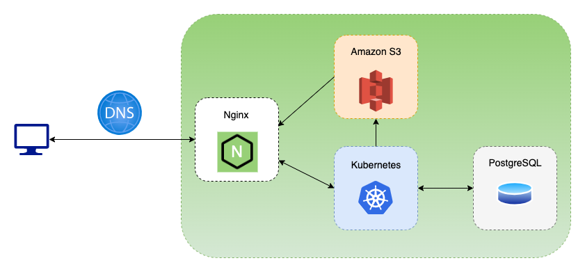

# Stripo Plugin Infrastructure Overview
On the high level Stripo plugin infrastructure looks like:

Plugin infrastructure consists of 17 microservices that are wrapped into the docker
containers/images. These images are hosted in the Stripo Docker Hub Repository to
which partners can get the read-only access (just to be able to download the images with
needed particular versions) once they’re on Enterprise pricing plan and intend to host Plugin
Backend on their server.
Some microservices have their own Databases (PostgreSQL) that may be deployed
in any place. The connection between services and their DB are specified via properties.
Infrastructure also provides you with the ability to send logs from every microservice to ELK
stack. ELK stack can be also deployed in any place. The url to ELK can be specified via properties.

The list of actual microservices and their responsibilities are described in the table below:

| Service name | Responsibility | Is public for web |
| ----------- | ----------- | ----------- | 
| stripo-plugin-api-gateway | Used for user’s authentication, authorization and requests routing  | true |
| emple-ui | Used to serve Stripo editor static files: js, css, fonts, icons | true |
| stripo-plugin-proxy-service | Used to proxy Stripo editor JS requests to different domains to avoid CORS error | true |
| countdowntimer | Used to create timer gif | true |
| stripo-plugin-details-service | Used for CRUD operations with plugin configuration | false |
| stripo-plugin-statistics-service | Used to store user sessions statistic | false |
| stripo-plugin-drafts-service | Used to store patches (email changes) on autosave| false |
| patches-service | Used to recreate complete email from autosave patches| false |
| stripo-plugin-documents-service | Used to handle documents (images) read/upload| false |
| stripo-plugin-custom-blocks-service | Used for CRUD operations with modules | false |
| stripo-timer-api | Used for interaction with timer and store timer usage statistic | false |
| screenshot-service | Used to generate images by HTML for modules preview | false |
| stripo-plugin-image-bank-service | Used to interact with external services like pixabay, pexels, iconFinder | false |
| stripe-html-gen-service | Used to parse external sites and extract information for smart-modules | false |
| stripo-security-service | Used to check external URLs for security (protocol, internal AWS IPs) | false |
| stripe-html-cleaner-service | Used to compile HTML and CSS from Stripo editor to clean compressed HTML ready to be sent to customers | false |
| amp-validator-service | Used to check is AMP HTML code valid | false |

### Communication between microservices

